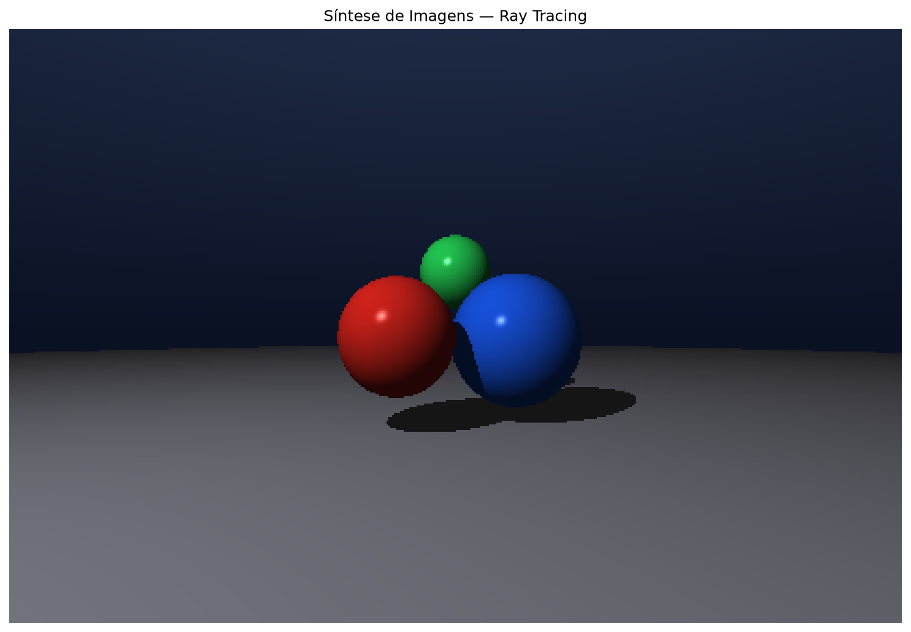
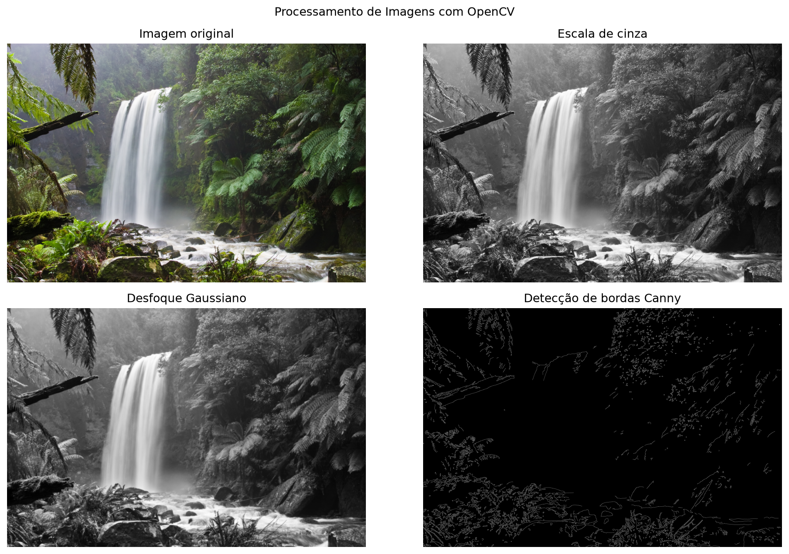
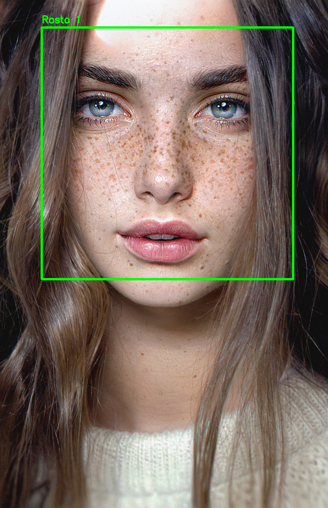
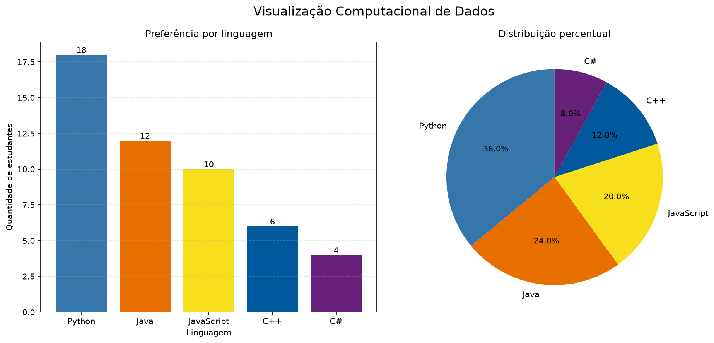

# AC01 — Áreas Relacionadas à Computação Visual

## Objetivo

Demonstrar as diferenças e as principais características das seguintes áreas relacionadas à Computação Visual:

- Síntese de Imagens ou Computação Gráfica;
- Processamento de Imagens;
- Visão Computacional;
- Visualização Computacional.

Para cada área foi selecionada uma aplicação baseada em código disponível em repositórios públicos. As aplicações foram executadas localmente e seus resultados estão apresentados neste documento.

## Comparação entre as áreas

| Área | Entrada | Processamento | Saída |
|---|---|---|---|
| Síntese de Imagens | Cena, câmera, objetos e luz | Geração matemática dos pixels | Imagem sintética |
| Processamento de Imagens | Imagem existente | Transformações nos pixels | Outra imagem |
| Visão Computacional | Imagem existente | Extração de informações | Objetos e posições identificadas |
| Visualização Computacional | Dados numéricos | Representação gráfica | Gráficos para interpretação humana |

## Tecnologias utilizadas

- Python 3;
- NumPy;
- Matplotlib;
- OpenCV;
- Git e GitHub.

## Instalação

Na pasta principal do repositório, crie e ative um ambiente virtual:

```powershell
py -m venv .venv
.\.venv\Scripts\Activate.ps1
```

Instale as dependências:

```powershell
python -m pip install -r .\AC01\requirements.txt
```

---

## 1. Síntese de Imagens — Ray Tracing

### Definição

Síntese de Imagens, também chamada de Computação Gráfica, é a área responsável por gerar imagens a partir de representações matemáticas de cenas, objetos, câmeras, materiais e fontes de luz.

### Aplicação escolhida

Foi implementado um Ray Tracer didático em Python. A cena possui três esferas coloridas, um plano, uma câmera e uma fonte de luz.

Para cada pixel da imagem, o programa lança um raio partindo da câmera. O algoritmo calcula se o raio atingiu algum objeto e determina a cor do pixel utilizando iluminação, sombras e reflexos especulares.

### Aspectos específicos demonstrados

- Representação matemática de objetos;
- Posição da câmera;
- Raios de visualização;
- Interseção entre raios e esferas;
- Iluminação difusa;
- Reflexo especular;
- Projeção de sombras;
- Geração de uma imagem que não existia anteriormente.

### Execução

```powershell
python .\AC01\01-Sintese-de-Imagens\ray_tracing.py
```

### Resultado



### Por que pertence à Síntese de Imagens?

A entrada não é uma fotografia. A entrada é uma descrição matemática formada por câmera, objetos, cores e luz. O resultado é uma nova imagem sintetizada pelo computador.

### Referência pública

- [Ray Tracing em Python — repositório público](https://github.com/rdgarce/Ray_tracing)

---

## 2. Processamento de Imagens — Filtros com OpenCV

### Definição

Processamento de Imagens é a área que aplica operações sobre os pixels de uma imagem existente para corrigir, realçar ou extrair características visuais.

### Aplicação escolhida

Foi utilizada uma fotografia como entrada. O programa produz três transformações:

1. Conversão para escala de cinza;
2. Aplicação de desfoque Gaussiano;
3. Detecção de bordas pelo algoritmo de Canny.

### Aspectos específicos demonstrados

- Leitura de uma imagem digital;
- Conversão do espaço de cores;
- Suavização de ruídos;
- Análise das variações de intensidade;
- Identificação de contornos;
- Geração de novas imagens a partir da original.

### Execução

```powershell
python .\AC01\02-Processamento-de-Imagens\processamento_imagem.py
```

### Resultado



### Por que pertence ao Processamento de Imagens?

A entrada e a saída são imagens. O algoritmo modifica ou analisa os pixels, mas não tenta compreender quais objetos estão presentes na fotografia.

### Referência pública

- [Exemplos oficiais do OpenCV](https://github.com/opencv/opencv/tree/4.x/samples/python)

---

## 3. Visão Computacional — Detecção de Rostos

### Definição

Visão Computacional é a área que busca extrair informações e significado de imagens ou vídeos.

### Aplicação escolhida

Foi utilizado o classificador Haar Cascade do OpenCV para detectar rostos em uma fotografia. O programa converte a imagem para escala de cinza, analisa diferentes regiões e identifica padrões associados a rostos humanos.

Depois da detecção, o programa retorna as posições encontradas e desenha um retângulo verde ao redor de cada rosto.

### Aspectos específicos demonstrados

- Análise automática do conteúdo da imagem;
- Uso de um classificador previamente treinado;
- Detecção em diferentes escalas;
- Localização de objetos;
- Contagem de rostos;
- Representação das posições por coordenadas.

### Execução

```powershell
python .\AC01\03-Visao-Computacional\deteccao_rostos.py
```

### Resultado



### Por que pertence à Visão Computacional?

O objetivo não é apenas alterar os pixels. O programa extrai uma informação: quantos rostos aparecem e em quais posições da imagem eles estão localizados.

### Referência pública

- [Exemplo oficial de detecção facial do OpenCV](https://github.com/opencv/opencv/blob/4.x/samples/python/facedetect.py)

---

## 4. Visualização Computacional — Gráficos com Matplotlib

### Definição

Visualização Computacional utiliza recursos gráficos para representar dados abstratos ou numéricos, facilitando a análise e a interpretação por seres humanos.

### Aplicação escolhida

Foi criado um arquivo CSV demonstrativo contendo linguagens de programação e quantidades de estudantes. O programa lê esses dados e gera:

- Um gráfico de barras;
- Um gráfico de setores;
- Valores absolutos;
- Distribuições percentuais.

### Aspectos específicos demonstrados

- Leitura de dados estruturados;
- Transformação de números em elementos visuais;
- Comparação entre categorias;
- Apresentação de proporções;
- Uso de cores, rótulos e legendas.

### Execução

```powershell
python .\AC01\04-Visualizacao-Computacional\visualizacao_dados.py
```

### Resultado



### Por que pertence à Visualização Computacional?

A entrada é formada por dados numéricos, e não por uma cena ou fotografia. Os gráficos ajudam uma pessoa a identificar rapidamente diferenças e proporções existentes nos dados.

### Referência pública

- [Galeria oficial de exemplos do Matplotlib](https://github.com/matplotlib/matplotlib/tree/main/galleries/examples)

---

## Conclusão

As quatro áreas trabalham com elementos visuais, mas possuem objetivos diferentes.

Na Síntese de Imagens, o computador cria uma imagem a partir de uma cena matemática. No Processamento de Imagens, uma imagem existente é transformada em outra imagem. Na Visão Computacional, o computador extrai informações e tenta compreender o conteúdo visual. Na Visualização Computacional, dados abstratos são convertidos em representações gráficas para facilitar a interpretação humana.