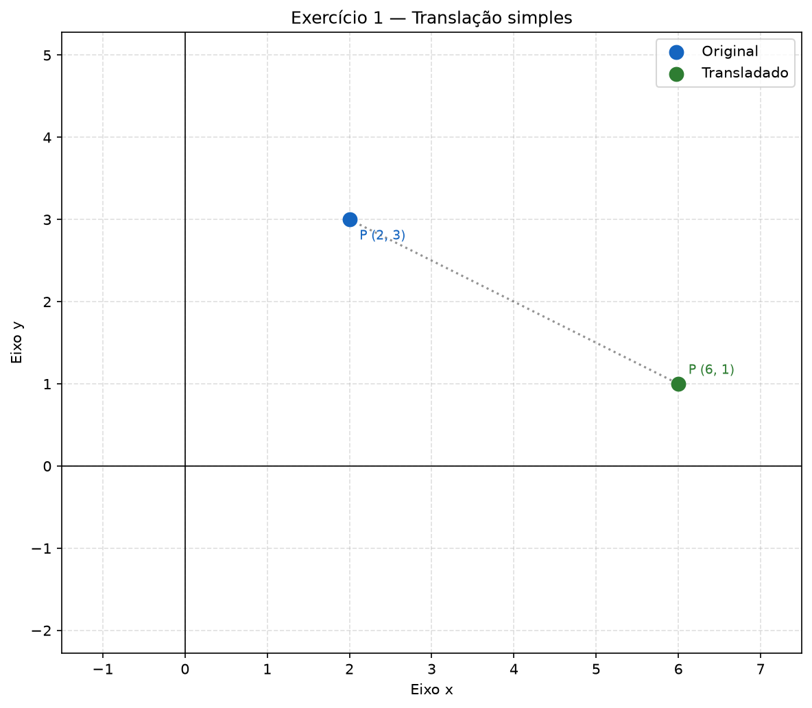
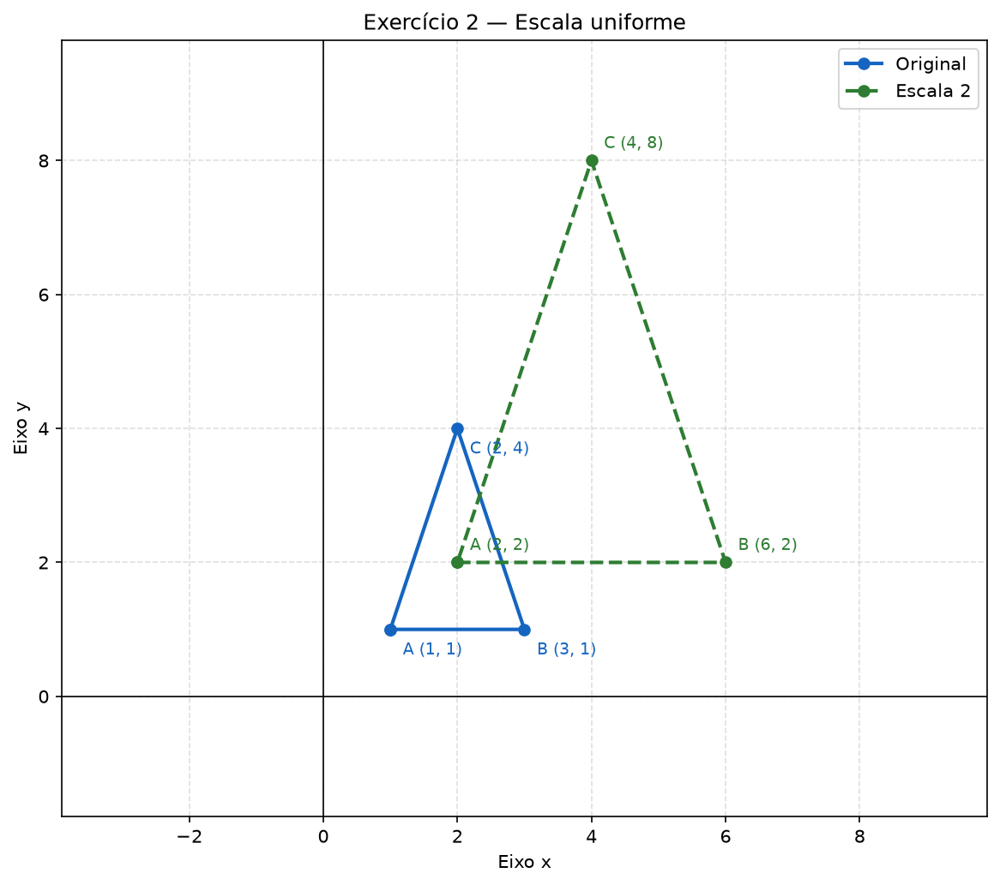
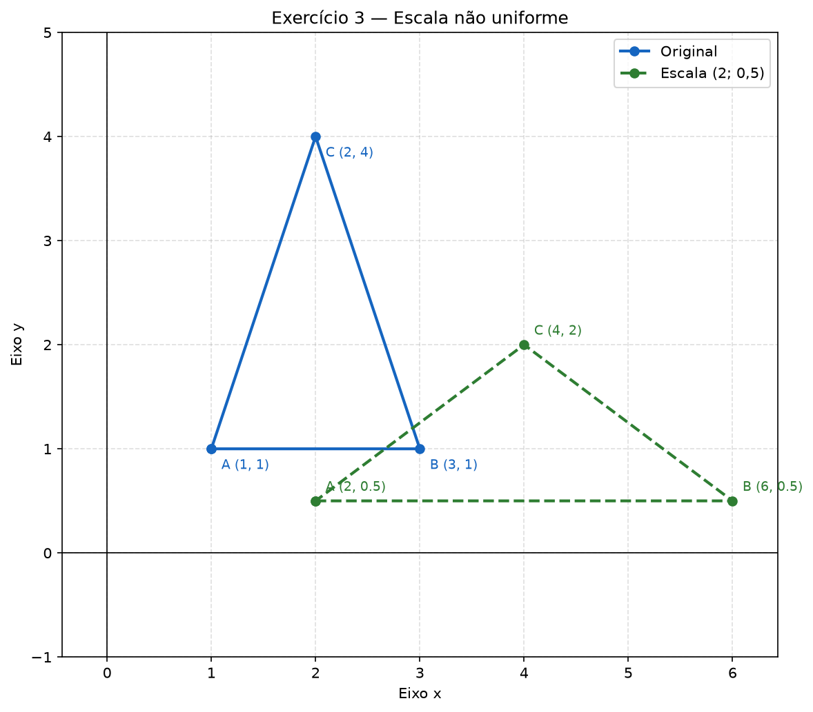
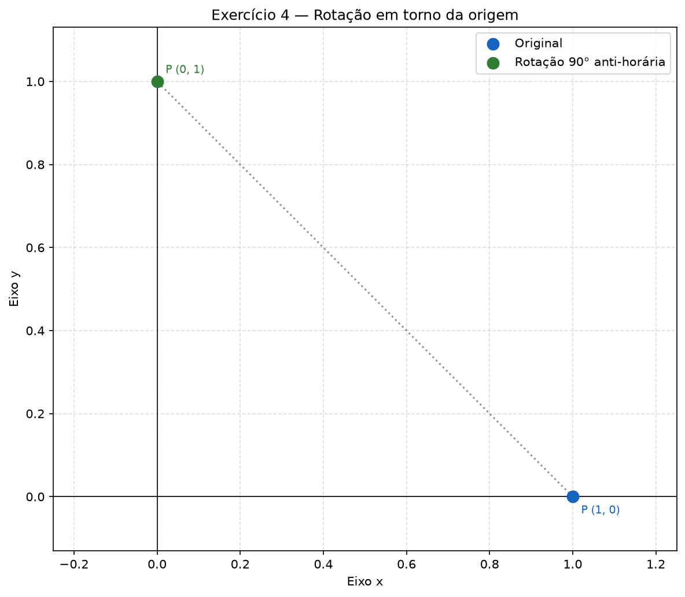
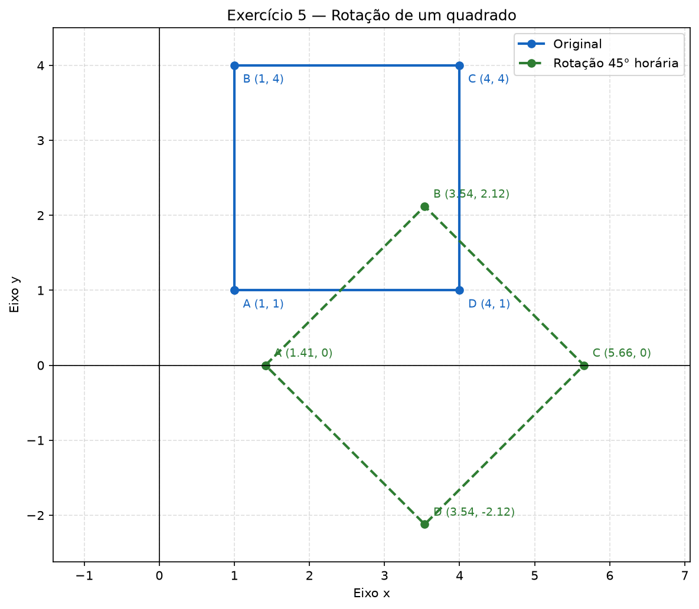
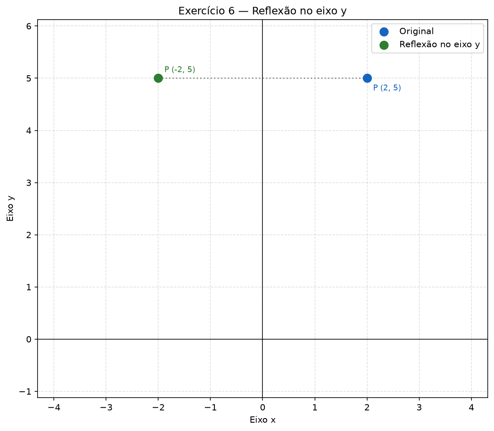
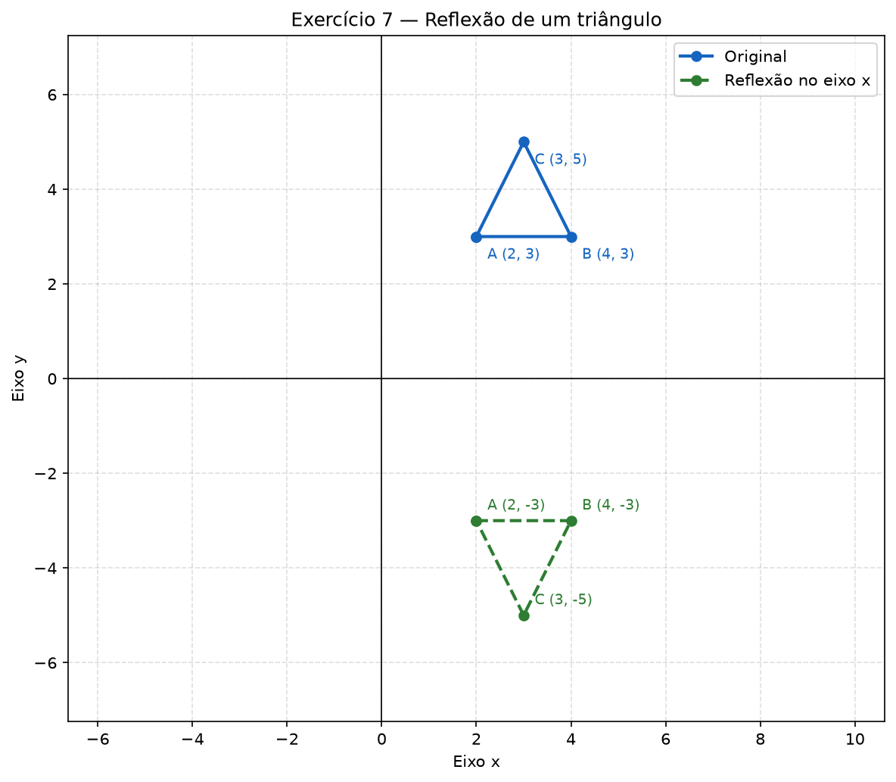
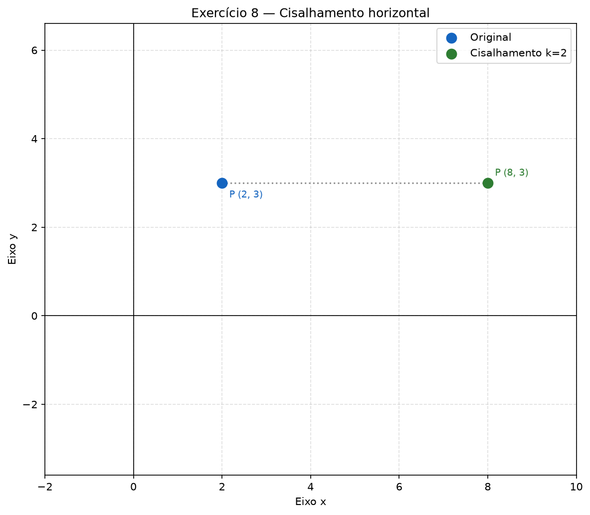
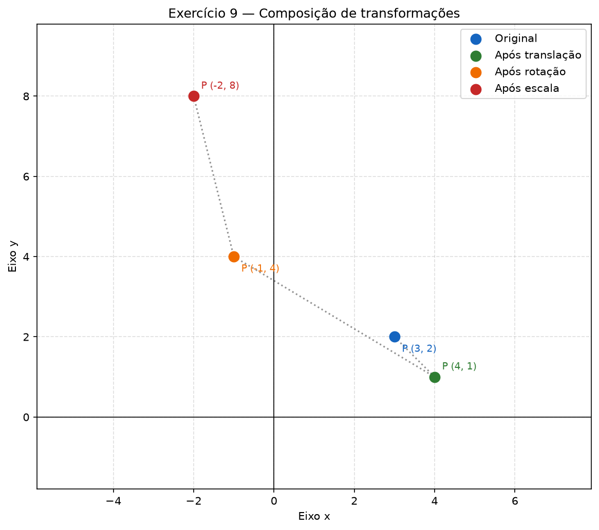
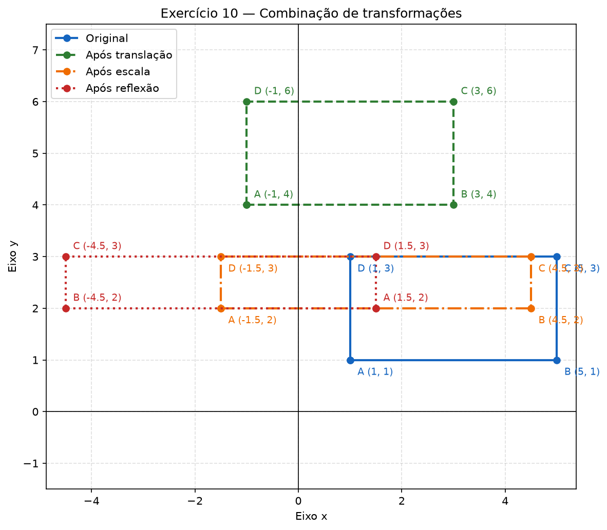

# AC02 — Transformações Geométricas 2D

## Objetivo

Aplicar transformações geométricas bidimensionais em pontos e polígonos utilizando Python, NumPy e Matplotlib.

Foram desenvolvidos dez exercícios envolvendo:

- Translação;
- Escala uniforme;
- Escala não uniforme;
- Rotação;
- Reflexão;
- Cisalhamento;
- Composição de transformações.

Os gráficos apresentam os objetos antes e depois de cada transformação.

## Tecnologias utilizadas

- Python 3;
- NumPy;
- Matplotlib.

## Execução

Na pasta principal do repositório, execute:

```powershell
python .\AC02\transformacoes_geometricas.py
```

Os gráficos serão salvos na pasta:

```text
AC02/resultados
```

> Quando o enunciado não informa outro ponto de referência, as escalas e rotações são realizadas em relação à origem `(0,0)`.

---

## Exercício 1 — Translação simples

### Enunciado

Transladar o ponto `P(2,3)` utilizando o vetor `(4,-2)`.

A translação é calculada por:

```text
x' = x + tx
y' = y + ty
```

Aplicando os valores:

```text
x' = 2 + 4 = 6
y' = 3 - 2 = 1
```

### Resposta

```text
P'(6,1)
```

As duas coordenadas foram alteradas: `x` aumentou quatro unidades e `y` diminuiu duas unidades.

### Gráfico



---

## Exercício 2 — Escala uniforme

### Enunciado

Aplicar uma escala uniforme de fator `2` ao triângulo:

```text
A(1,1), B(3,1), C(2,4)
```

Na escala uniforme:

```text
x' = 2x
y' = 2y
```

### Resposta

```text
A'(2,2)
B'(6,2)
C'(4,8)
```

A largura e a altura do triângulo dobram. Como a área é afetada pelos dois eixos, ela fica quatro vezes maior.

### Gráfico



---

## Exercício 3 — Escala não uniforme

### Enunciado

Aplicar ao triângulo anterior uma escala de fator `2` no eixo `x` e `0,5` no eixo `y`.

```text
x' = 2x
y' = 0,5y
```

### Resposta

```text
A'(2; 0,5)
B'(6; 0,5)
C'(4; 2)
```

O triângulo é alongado horizontalmente e comprimido verticalmente.

### Gráfico



---

## Exercício 4 — Rotação em torno da origem

### Enunciado

Rotacionar o ponto `P(1,0)` em `90°` no sentido anti-horário.

A rotação é calculada por:

```text
x' = x·cos(θ) - y·sen(θ)
y' = x·sen(θ) + y·cos(θ)
```

Para `θ = 90°`:

```text
x' = 0
y' = 1
```

### Resposta

```text
P'(0,1)
```

### Gráfico



---

## Exercício 5 — Rotação de um polígono

### Enunciado

Rotacionar o quadrado abaixo em `45°` no sentido horário:

```text
A(1,1), B(1,4), C(4,4), D(4,1)
```

Uma rotação horária de `45°` corresponde ao ângulo `-45°`.

### Resposta aproximada

```text
A'(1,41; 0)
B'(3,54; 2,12)
C'(5,66; 0)
D'(3,54; -2,12)
```

### Valores exatos

```text
A'(√2; 0)
B'(5√2/2; 3√2/2)
C'(4√2; 0)
D'(5√2/2; -3√2/2)
```

O quadrado mantém seu tamanho e seu formato, pois a rotação altera somente sua orientação e posição em relação à origem.

### Gráfico



---

## Exercício 6 — Reflexão simples

### Enunciado

Refletir o ponto `P(2,5)` em relação ao eixo `y`.

Na reflexão em relação ao eixo `y`:

```text
x' = -x
y' = y
```

### Resposta

```text
P'(-2,5)
```

A coordenada `x` troca de sinal, enquanto a coordenada `y` permanece igual.

### Gráfico



---

## Exercício 7 — Reflexão de um triângulo

### Enunciado

Refletir em relação ao eixo `x` o triângulo:

```text
A(2,3), B(4,3), C(3,5)
```

Na reflexão em relação ao eixo `x`:

```text
x' = x
y' = -y
```

### Resposta

```text
A'(2,-3)
B'(4,-3)
C'(3,-5)
```

### Gráfico



---

## Exercício 8 — Cisalhamento horizontal

### Enunciado

Aplicar um cisalhamento horizontal com `k = 2` ao ponto `P(2,3)`.

O cisalhamento horizontal é calculado por:

```text
x' = x + k·y
y' = y
```

Aplicando os valores:

```text
x' = 2 + 2·3 = 8
y' = 3
```

### Resposta

```text
P'(8,3)
```

### Gráfico



---

## Exercício 9 — Composição de transformações

### Enunciado

Aplicar ao ponto `P(3,2)`, nesta ordem:

1. Translação pelo vetor `(1,-1)`;
2. Rotação de `90°` no sentido anti-horário;
3. Escala uniforme de fator `2`.

### Etapas

| Etapa | Coordenada |
|---|---|
| Ponto original | `(3,2)` |
| Após a translação | `(4,1)` |
| Após a rotação | `(-1,4)` |
| Após a escala | `(-2,8)` |

### Resposta

```text
P'(-2,8)
```

A ordem das transformações deve ser respeitada, pois alterar essa ordem pode produzir um resultado diferente.

### Gráfico



---

## Exercício 10 — Combinação de transformações

### Enunciado

Aplicar ao retângulo abaixo, nesta ordem:

```text
A(1,1), B(5,1), C(5,3), D(1,3)
```

1. Translação pelo vetor `(-2,3)`;
2. Escala de `1,5` no eixo `x` e `0,5` no eixo `y`;
3. Reflexão em relação ao eixo `y`.

### Primeira etapa — Translação

```text
A1(-1,4)
B1(3,4)
C1(3,6)
D1(-1,6)
```

### Segunda etapa — Escala não uniforme

```text
A2(-1,5; 2)
B2(4,5; 2)
C2(4,5; 3)
D2(-1,5; 3)
```

### Terceira etapa — Reflexão no eixo y

```text
A'(1,5; 2)
B'(-4,5; 2)
C'(-4,5; 3)
D'(1,5; 3)
```

### Resposta

As coordenadas finais são:

```text
A'(1,5; 2)
B'(-4,5; 2)
C'(-4,5; 3)
D'(1,5; 3)
```

### Gráfico



---

## Conclusão

A atividade demonstrou como diferentes transformações geométricas mudam pontos e figuras no plano cartesiano.

A translação move a posição, a escala muda as dimensões, a rotação muda a orientação, a reflexão espelha o objeto e o cisalhamento inclina a figura. Também foi possível observar que, em uma composição, as transformações precisam ser aplicadas exatamente na ordem indicada.
