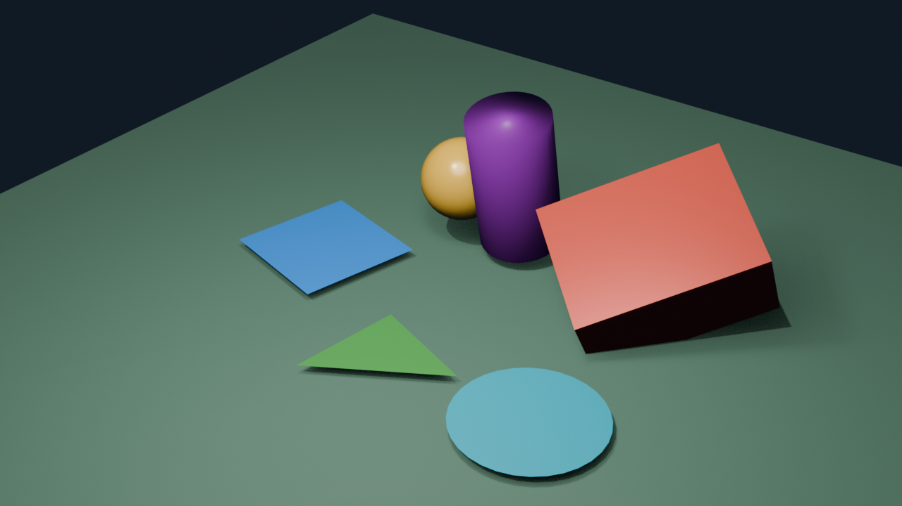

# AC03 — Transformações Geométricas 2D e 3D no Blender

**Aluno:** João Victor Bathomarco  
**Software:** Blender 4.5 LTS  
**Cena:** Parque Geométrico

## Arquivos entregues

- `AC03_JoãoVictorBathomarco.blend`: projeto completo do Blender;
- `AC03_JoãoVictorBathomarco.py`: script Python utilizado na atividade;
- `AC03_JoãoVictorBathomarco.png`: renderização final da cena.

## Renderização final

## Explicação da atividade

A cena foi construída no Blender 4.5 LTS e organizada na coleção `AC03_transformacoes`.  
Manualmente, criei o quadrado, o triângulo, o círculo e o cilindro.  
Nos objetos 2D foram aplicadas translação, rotação e escala no plano XY.  
O quadrado foi animado nos frames 1, 60 e 120, alterando sua posição e rotação.  
Por Python, foram criados o cubo e a esfera, com transformações em diferentes eixos.  
O cubo recebeu keyframes de localização, rotação e escala durante a animação.  
A esfera foi associada como filha de um objeto de controle, demonstrando uma transformação composta.  
O script também configurou materiais, iluminação, câmera, base da cena e o render final.

## Transformações realizadas

### Objetos 2D

- Quadrado: translação, rotação no eixo Z, escala uniforme e animação;
- Triângulo: translação, rotação no eixo Z e escala não uniforme;
- Círculo: translação e escala uniforme.

### Objetos 3D

- Cubo: translação, rotações nos eixos X, Y e Z, escala não uniforme e animação;
- Cilindro: translação, rotação no eixo X e escala no eixo Z;
- Esfera UV: translação, rotação, escala e movimento por hierarquia parent/child.

## Automação com Python

O script utiliza a biblioteca `bpy` para criar e modificar objetos no Blender. Foram usadas as propriedades `location`, `rotation_euler` e `scale`. Os valores de rotação em graus foram convertidos para radianos com `math.radians()`. Também foram inseridos keyframes nos frames 1, 60 e 120.

## Questões teóricas

### 1. Qual é a diferença entre translação, rotação e escala?

A translação altera a posição do objeto no espaço. A rotação modifica sua orientação ao redor de um eixo ou ponto de referência. A escala altera seu tamanho e suas proporções nos eixos X, Y e Z.

### 2. Qual é a diferença entre espaço local e espaço global?

No espaço global, as transformações utilizam os eixos fixos da cena do Blender. No espaço local, são utilizados os eixos próprios do objeto, que podem mudar de orientação depois que o objeto é rotacionado.

### 3. Por que rotações em eixos diferentes geram resultados distintos?

Cada eixo representa uma direção diferente no espaço tridimensional. Além disso, a ordem das rotações pode alterar o resultado, pois uma rotação modifica a orientação dos eixos usados pela transformação seguinte.

### 4. Por que utilizar `math.radians()` em `rotation_euler`?

O Blender armazena os valores de `rotation_euler` em radianos. A função `math.radians()` permite escrever o ângulo em graus, facilitando a leitura, e convertê-lo para a unidade esperada pelo Blender.

### 5. Quando é melhor utilizar Python em vez da interface manual?

Python é útil quando é necessário criar muitos objetos, repetir transformações, trabalhar com valores exatos ou automatizar animações. Dessa forma, tarefas repetitivas podem ser executadas de maneira mais rápida e consistente.

## Bônus implementado

Foi utilizada uma hierarquia parent/child entre a esfera e o objeto `controle_orbita_esfera`. Quando o objeto de controle é rotacionado, a esfera realiza um movimento de órbita, demonstrando uma transformação composta.