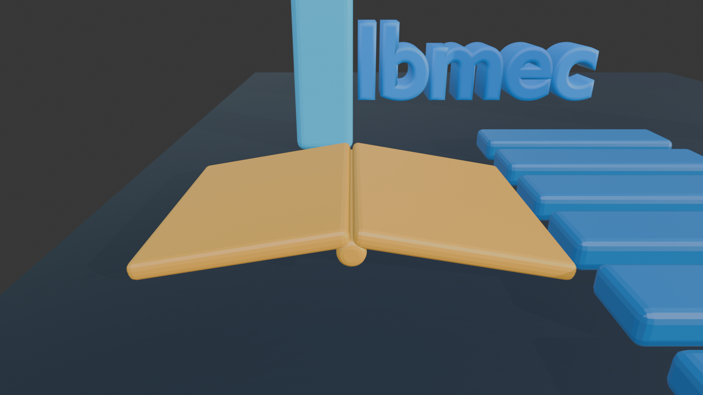
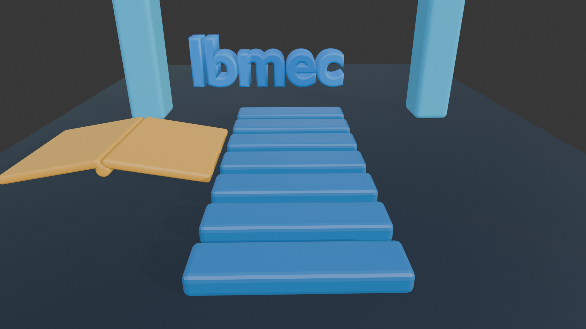
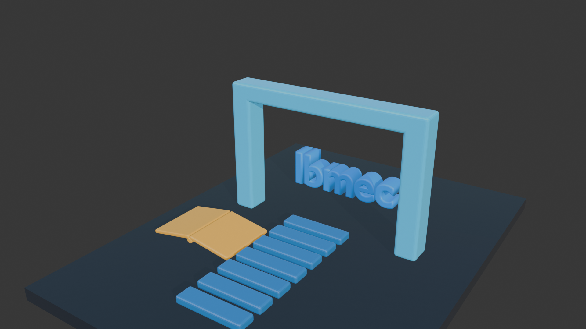

# AP1 — Relatório Técnico e Planejamento Visual: “Ibmec em 15 segundos”

**Aluno:** João Victor Bathomarco  
**Matrícula:** 202302902448  
**Curso / Turma:** Engenharia da Computação — Computação Gráfica — Turma 8001  
**Versão do Software:** Blender 4.5 LTS  
**Nome do Arquivo `.blend`:** `AP1_JoãoVictorBathomarco.blend`

---

## PARTE 1: RELATÓRIO CURTO

### 1. Título da Peça e Conceito Geral

**Título da Peça:** “Caminho para o Conhecimento”

**Conceito Visual:** A composição representa a jornada acadêmica como um percurso de desenvolvimento. O livro aberto simboliza o conhecimento e funciona como ponto inicial da narrativa. A partir dele, um caminho modular conduz o olhar do observador até um portal, criando uma sequência visual clara entre aprendizado, evolução e conquista.

O portal representa a passagem para novas oportunidades profissionais e acadêmicas. A palavra **Ibmec**, posicionada além do portal e preservada como elemento legível da marca, representa o destino dessa trajetória. As cores azul e ciano reforçam tecnologia, confiança e inovação, enquanto o dourado aplicado ao livro valoriza o conhecimento como elemento central da formação.

### 2. Narrativa e Destaque da Marca Ibmec

**Apresentação da Marca:** A palavra **Ibmec** foi criada como objeto de texto tridimensional e posicionada ao fundo da composição, centralizada dentro da abertura do portal. A câmera principal foi enquadrada para conduzir o olhar pelo caminho, atravessar o portal e chegar à marca. A escrita foi mantida completa, sem deformações ou alterações no nome, utilizando volume, acabamento arredondado e material azul para preservar sua integridade visual.

**Ideia de Transformação:** Para a futura animação de 15 segundos, a cena sugere uma revelação progressiva. A câmera começará próxima ao livro, avançará pelas peças do caminho e se aproximará do portal. Durante o percurso, os módulos poderão surgir ou elevar-se em sequência. No encerramento, o portal ganhará destaque e a palavra **Ibmec** será revelada integralmente, acompanhada de uma iluminação mais intensa.

### 3. Os Três Objetos Autorais

A cena contém exatamente três objetos autorais principais modelados para estruturar a composição:

1. **Objeto Autoral 1:** `obj_autoral_livro`
   - **Função na Cena:** Representa o conhecimento e marca o início da jornada visual. Sua posição próxima ao começo do caminho estabelece a relação entre estudo e desenvolvimento acadêmico.
   - **Modo de Construção:** Construído com primitivas do tipo cubo, achatadas, rotacionadas e unidas para formar as duas páginas. Um cilindro foi utilizado para representar a lombada central. As formas foram combinadas em um único objeto e receberam acabamento por Bevel.

2. **Objeto Autoral 2:** `obj_autoral_caminho`
   - **Função na Cena:** Conduz visualmente o observador do livro ao portal, simbolizando as etapas sucessivas do aprendizado e da evolução profissional.
   - **Modo de Construção:** Criado a partir de uma primitiva cúbica transformada em uma peça alongada. O modificador Array foi utilizado para produzir a repetição modular e o modificador Bevel suavizou as bordas.

3. **Objeto Autoral 3:** `obj_autoral_portal`
   - **Função na Cena:** Representa a passagem para novas oportunidades e enquadra a marca Ibmec no ponto final da composição.
   - **Modo de Construção:** Construído com três primitivas cúbicas, sendo duas colunas verticais e uma barra superior. As peças foram posicionadas, escaladas e unidas em um único objeto, com Bevel aplicado para arredondar as arestas.

> **Nota de autoria:** Nenhum modelo externo foi importado. Os três objetos autorais foram construídos diretamente no Blender. A base da cena e o objeto de texto “Ibmec” são elementos auxiliares criados no próprio arquivo e não são contabilizados como objetos autorais principais.

### 4. Técnicas de Modelagem e Transformações Geométricas

**Técnicas de Modelagem Utilizadas:** Foram utilizadas combinação e união de primitivas, edição das proporções das malhas, modificador **Bevel** para suavização das arestas e modificador **Array** para repetição das peças do caminho. A palavra Ibmec também recebeu extrusão e profundidade de Bevel para adquirir volume tridimensional.

**Transformações Geométricas:** A translação foi utilizada para distribuir os elementos no espaço e estabelecer a sequência livro, caminho, portal e marca. A rotação foi aplicada principalmente às páginas do livro e no posicionamento do texto, produzindo melhor leitura e aparência natural. A escala foi empregada de forma uniforme e não uniforme para ajustar a largura, altura e profundidade das primitivas, criar as proporções do portal e transformar o cubo original em módulos do caminho. Essas transformações contribuíram para a hierarquia visual e para o equilíbrio da cena.

### 5. Organização Técnica da Cena

- **Estrutura de Coleções:** Todos os elementos estão agrupados na coleção principal `AP1_Ibmec_Conceito`.
- **Configuração da Câmera:** A câmera principal `Camera_Principal` foi configurada e enquadrada para destacar o percurso completo, o portal e a palavra Ibmec.
- **Linha do Tempo Planejada:** A duração está configurada para **360 frames** a **24 fps**, totalizando 15 segundos.
- **Organização dos Objetos:** Os elementos receberam nomes coerentes no Outliner para facilitar a identificação e a futura animação na AP2.

### 6. Plano Resumido para a AP2 — Evolução da Cena

**Animação de Objetos e Câmera:** A câmera começará próxima ao livro aberto e avançará suavemente pelo caminho em direção ao portal. Os módulos do caminho poderão subir de forma sequencial, criando a sensação de construção da trajetória. O portal realizará uma leve transformação de escala e a palavra Ibmec será revelada gradualmente no enquadramento final.

**Iluminação e Materiais:** Será utilizada uma iluminação tecnológica em tons azulados e cianos, com luz de destaque dourada próxima ao livro. Os materiais atuais serão refinados com variações controladas de rugosidade, reflexo e emissão, mantendo contraste entre a base escura, o caminho azul, o portal ciano, o livro dourado e a marca Ibmec.

**Renderização Final:** A intenção é utilizar o motor **Eevee**, adequado para uma animação curta com boa qualidade e menor tempo de processamento. O vídeo final será exportado em resolução Full HD, com 24 fps e duração de 15 segundos.

---

## PARTE 2: STORYBOARD — PLANEJAMENTO AUDIOVISUAL DE 15 SEGUNDOS

O storyboard divide a animação planejada para a AP2 em três momentos principais, cobrindo os 360 frames a 24 fps.

### QUADRO 1 — INÍCIO E REVELAÇÃO

**Tempo:** 0 a 3 segundos  
**Frames:** 1 a 72

- **Ação/Movimento:** A câmera começa em plano aproximado do livro aberto e inicia um movimento suave para frente e para cima, revelando as primeiras peças do caminho.
- **Elementos em Destaque:** Livro dourado, início do caminho modular e base escura.
- **Foco do Áudio/Visual:** Início discreto de uma trilha tecnológica, com iluminação concentrada no livro para representar o surgimento do conhecimento.

### QUADRO 2 — TRANSFORMAÇÃO E CLÍMAX

**Tempo:** 3 a 10 segundos  
**Frames:** 73 a 240

- **Ação/Movimento:** A câmera acompanha o caminho em direção ao portal. Os módulos surgem ou se elevam em sequência, enquanto o portal recebe uma leve ampliação para reforçar sua importância.
- **Elementos em Destaque:** Caminho modular, portal ciano e aparição progressiva da palavra Ibmec.
- **Foco do Áudio/Visual:** Crescimento da trilha e intensificação gradual das luzes azuladas, conduzindo ao ponto de maior energia da vinheta.

### QUADRO 3 — ENCERRAMENTO E FIXAÇÃO DA MARCA

**Tempo:** 10 a 15 segundos  
**Frames:** 241 a 360

- **Ação/Movimento:** A câmera desacelera ao atravessar visualmente o portal e termina estabilizada no enquadramento principal.
- **Elementos em Destaque:** Portal completo e palavra Ibmec centralizada, íntegra e perfeitamente legível.
- **Foco do Áudio/Visual:** A iluminação destaca a marca, a trilha atinge sua resolução e a cena permanece estática por alguns instantes para fixação visual.

---

## Arquivos Visuais Relacionados

- `AP1_JoãoVictorBathomarco_Principal.png` — enquadramento principal da cena.
- `AP1_JoãoVictorBathomarco_Captura_Portal.png` — detalhe do portal e da marca.
- `AP1_JoãoVictorBathomarco_Captura_Livro.png` — detalhe do livro aberto.
- `AP1_JoãoVictorBathomarco_Captura_Caminho.png` — detalhe do caminho modular.
